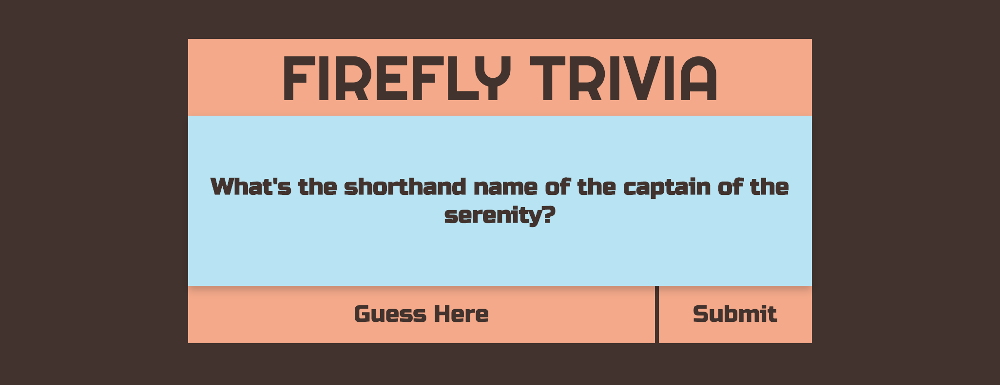

## Firefly-Trivia
Trivia game for General Assembly first project that allows us to use what we have learned in class.  Using HTML, CSS, Javascript, and Api and no frameworks. 

## Link
Live URL: https://creizai.github.io/Firefly-Trivia/

## How to use?
Type in your guess into the guess box and hit **enter**
To start a new game please just hit refresh on your browser for now.

## Motivation
I love Firefly and still had a fear of api's and comparing answers with a inputbox.  I also didn't want to use any template for style, I just want to freeform it.  

## Build status
Has commented out code for an API that I eventually didn't like to use.  I'm leaving this code in for when I create my own API to connect it.
 
## Screenshots

## API Reference
Had been using this
https://trivia.propernerd.com/

## Credits
SEI34 **mates** and Instructors
## License
A short snippet describing the license (MIT, Apache etc)

MIT © [Adam Bates]()
